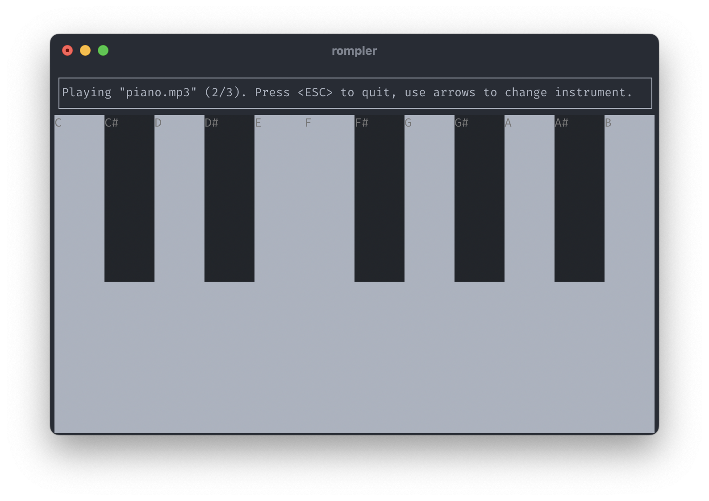

# rompler

A simple rompler[^1] made in Rust, allowing you to play music inside your terminal!



## Features

- [x] Support playing single notes and chords from sample audio file (using [rodio](https://github.com/RustAudio/rodio))
- [x] Terminal User Interface (TUI) displaying a piano roll (using [ratatui](https://github.com/ratatui/ratatui))
- [x] Support for multiple instruments (using arrow keys)

## Build and run

```sh
git clone https://github.com/0lbap/rompler.git
cd rompler
cargo run
```

## Adding your own instruments

You can easily add your own audio files to the sound bank by putting them under the `sounds/` directory!

## Credits

Piano sound effect in `sounds/piano.mp3` by <a href="https://pixabay.com/users/freesound_community-46691455/?utm_source=link-attribution&utm_medium=referral&utm_campaign=music&utm_content=95007">freesound_community</a> from <a href="https://pixabay.com//?utm_source=link-attribution&utm_medium=referral&utm_campaign=music&utm_content=95007">Pixabay</a>.

[^1]: _A rompler is an electronic musical instrument that plays pre-fabricated sounds based on audio samples. The term rompler is a blend of the terms ROM and sampler. In contrast to samplers, romplers do not record audio._ (Wikipedia)
